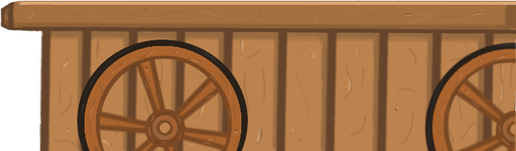
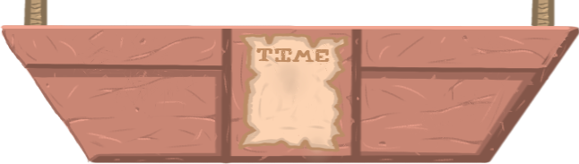
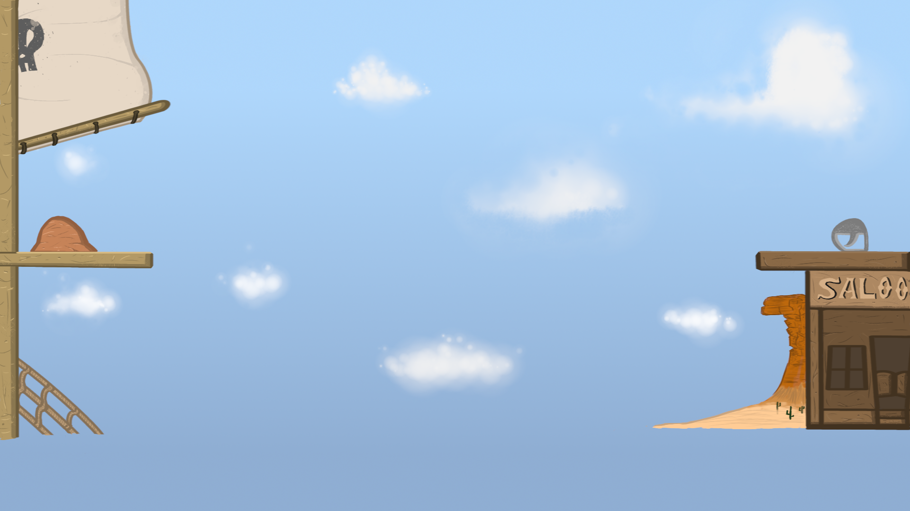
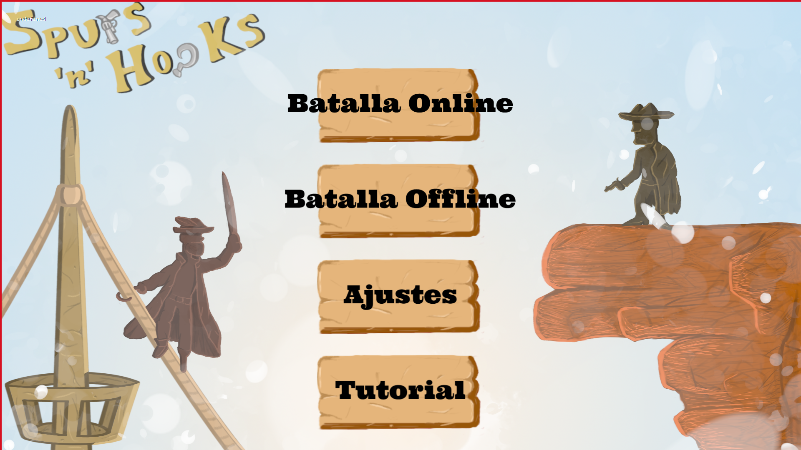
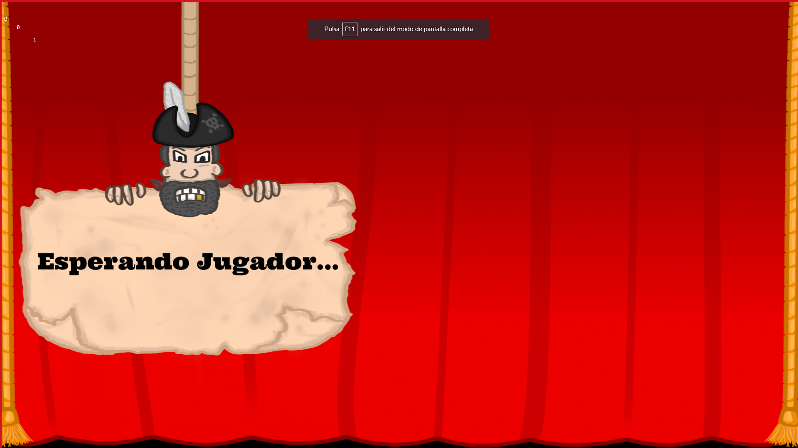

# Spurs'n'Hooks

<h2> <strong>NOMBRES:</strong></h2>

-Miguel Ángel Arcones Ríos, Email: ma.arcones@alumnos.urjc.es, Github: <b>M-Arcones</b>

-Manuel Aguado Salguero, Email: m.aguado.2016@alumnos.urjc.es, GitHub: <b>EmeAG</b>

-Daniel Muñoz Serrano, Email: d.munozs.2016@alumnos.urjc.es, GitHub: <b>Dani020998</b>

<h2><strong>CONCEPTO:</strong> </h2>

 <strong>Nombre del Juego:</strong>  Spurs ‘n’ hooks. 

<strong>Nombre del estudio:</strong> Piña Colada Studios.

<strong>Plataforma:</strong> PC y Móvil.

<strong>Versión:</strong> 1.0

<strong>Sinopsis de jugabilidad y contenido:</strong> Videojuego de estrategia y acción PvP, con partidas rápidas divididas en dos fases. La primera fase consta de la parte de construcción de las defensas, mientras que la segunda fase es la destrucción y derrota de los soldados enemigos y sus defensas. Con estética cartoon y ambientación de piratas contra vaqueros.

<strong>Categoría:</strong> Videojuego de estrategia competitivo, móvil, web.

<strong>Licencia:</strong> Apache 2.

<strong>Tecnología:</strong> JavaScript, Phaser, Gimp, tableta gráfica, Ubuntu, MySQL.

<strong>Público:</strong> Jugador casual.

<h2><strong>VISION GENERAL DEL JUEGO:</strong></h2>

Es un videojuego competitivo, de partidas rápidas, que te permita jugar a él como pasatiempo en cuando lo necesites, sin necesidad de altos requisitos tecnológicos. Compite contra tus amigos (y no tan amigos) en cualquier momento o lugar, solo necesitas tu teléfono móvil. Siempre es buen momento para enviar un cañonazo a tu archienemigo.

<h2><strong>MECÁNICA DEL JUEGO:</strong></h2>

<strong>Cámara:</strong> de perfil, 2D plataformas. Teclado y ratón para pc y controles táctiles para móviles. 
  
<strong>Controles:</strong> Tanto para la fase de construcción como de combate, se utilizará el ratón para colocar los materiales y para controlar la fuerza y dirección del disparo. El juego usará botones de selección, para la fase de la construcción, para elegir la forma y el material y se pulsará en la zona que se prefiera colocar la pieza, y botones para elegir el armamento.

Durante la batalla se tendrán botones en la pantalla para elegir el tipo de bala a disparar y el disparo se regulará mediante pulsaciones y arrastre mediante ratón o pantalla táctil.

En el primer inicio del juego por un jugador nuevo, se le otorgará x monedas, que tiene para emplearlos en las partidas rápidas, que cuestan xx monedas, y pueden ser 25, 100, 500 o 1000, dependiendo de la cantidad de monedas que quieras apostar. En el caso de ganar la batalla, el jugador reibirá el doble de lo apostado.. El otro contrincante perderá las monedas apostadas. Dentro de la batalla, se otorgará una cantidad aleatoria y de igual cantidad para los dos jugadores. Éstos tendran que gestionar ese dinero para las tres rondas del combate. Estas monedas se pueden gastar en materiales de construcción y munición.

Se recompensará al jugador con una lista de diferentes botines de monedas por cada día logeado. 

Con respecto a la puntuación, esta dependerá de las monedas apostadas:
-Si se apuestan 25, por victoria se recibiran entre 3 y 5 puntos, y por derrota se perderán entre 1 y 4.
-Si se apuestan 100, por victoria se recibiran entre 6 y 9 puntos, y por derrota se perderán entre 4 y 7.
-Si se apuestan 500, por victoria se recibiran entre 13 y 17 puntos, y por derrota se perderán entre 10 y 15.
- Y si se apuestan 1000, por victoria se recibiran entre 20 y 30 puntos, y por derrota se perderán entre 18 y 26.
En caso de perder la totalidad o más de los puntos, el marcador se pararía en 0.

Para añadir dificultad a los disparos, se incluirá una mecanica de viento que modificará la trayectoria del proyectil según su velocidad y dirección. A su vez, se añadirán obstáculos, móviles o fijos, entre los dos jugadores para entorpecer los disparos.

En cuanto a la elección de contrincante, habrá dos opciones. Una en la que se elige al jugador contrario de forma aleatoria pero teniendo en cuenta sus batallas ganadas y que sean el mismo numero que el jugador. La otra forma sera mediante búsqueda del nombre del usuario contrincante. 

<strong>Puntuación:</strong> Se guardará una puntuación global de todos los puntos conseguidos por cada jugador.

<strong>Guardar/Cargar:</strong> Se guardará la cuenta del usuario para poder mantener su puntuación.

<h2><strong>ESTADOS DEL JUEGO</strong></h2>

Pantalla de carga.
Menú de inicio.
Ajustes.
Tutorial.
Pantalla de combate.
Pantalla de marcador de puntuación. 

<h2><strong>INTERFACES:</strong></h2>

El estilo grafico del juego es cartoon con temática de piratas contra vaqueros. Los colores serán cálidos. Los fondos estarán difuminados para centrar la acción en el primer plano.

<strong>Nombre de la pantalla:</strong> Pantalla de carga. 
<strong>Descripción de la pantalla:</strong> Pantalla en la que se detalla el tiempo que queda para que cargue la partida y los logos del juego y empresa. 
<strong>Estados del juego:</strong> Invocado por: Pantalla de carga. <strong>Invoca a:</strong>  Menú de inicio. 
<strong>Nombre de la pantalla:</strong> Menú de inicio. 
<strong>Descripción de la pantalla:</strong> pantalla con las diferentes opciones del juego, donde se encuentran los botones de acceso a otros estados. 
<strong>Estados del juego: Invocado por:</strong> Pantalla de carga.  <strong>Invoca a:</strong>  ajustes, Tutorial, Pantalla de marcador de puntuación, batalla offline y batalla online. 

<strong>Nombre de la pantalla:</strong> Ajustes. 
<strong>Descripción de la pantalla:</strong> Estado del juego que permite al jugador establecer las diferentes configuraciones del juego como volumen de la música, efectos de sonido o idioma. 
<strong>Estados del juego:</strong> Invocado por: Menú de inicio.<strong> Invoca a:</strong>  Ajustes. 

<strong>Nombre de la pantalla:</strong> Tutorial. 
<strong>Descripción de la pantalla:</strong> Se muestra al jugador un video explicando las mecánicas del videojuego. 
<strong>Estados del juego:</strong> Invocado por: Menú de inicio. <strong>Invoca a:</strong>  Tutorial. 

<strong>Nombre de la pantalla:</strong> Pantalla de combate online. 
<strong>Descripción de la pantalla:</strong> Pantalla en el que transcurre el gameplay del videojuego PvP online. 
<strong>Estados del juego:</strong> <strong>Invocado por:</strong> Pantalla de combate.  <strong>Invoca a:</strong>  Pantalla de marcador de puntuación.  

<strong>Nombre de la pantalla:</strong> Pantalla de combate offline. 
<strong>Descripción de la pantalla:</strong> Pantalla en el que transcurre el gameplay del videojuego PvP por turnos. 
<strong>Estados del juego: Invocado por:</strong> Pantalla de combate. <strong> Invoca a:</strong>  Pantalla de marcador de puntuación.  

<strong>Nombre de la pantalla:</strong> Pantalla de marcador de puntuación.  
<strong>Descripción de la pantalla:</strong> Estado en el que se muestra la puntuación global con los puntos de cada jugador registrado. 
<strong>Estados del juego: Invocado por:</strong> Pantalla de combate. <strong>Invoca a:</strong>  Menú de inicio. 

<h2><strong>NIVELES:</strong></h2>

El juego consta de un único nivel en el que se compite contra otro jugador. Este nivel podrá tener obstáculos en medio del escenario de forma aleatoria, que compliquen los disparos.

<strong>Título del Nivel:</strong> War Field. 
<strong>Encuentro:</strong> Es el único nivel del juego, en él se sitúa el campo de batalla, con las zonas de cada equipo. 
<strong>Objetivos:</strong> Derrotar al equipo contrario. 
<strong>Enemigos:</strong> El jugador contrario. 
<strong>Ítems: </strong>Materiales, balas y monedas de oro. 
<strong>Personajes:</strong> Vaqueros y piratas. 
<strong>Música y Efectos de Sonido:</strong> sonido de disparo, sonido de golpe, música de fondo de construcción, música de fondo de batalla, música de ganar partida, música de perder partida, sonido de matar un soldado enemigo, sonido de muerte de un soldado propio. 
<strong>Referencias de BGM y SFX: </strong> 

<h2><strong>ESCENAS:</strong></h2>

<h3>Batalla Online</h3>
El juego se compone de las siguientes escenas:

<h4>Escena de Busqueda jugador:</h4>
 - Aleatorio en funcion del nivel
   - Texto de "Buscando rival" con un fondo.
 - Busqueda por nickname
   - Caja de texto, para introducir el nickname. (Jugador que busca)
   - Aviso de solicitud de combate.(Openente encontrado)
   - Mensaje de "Esperando respuesta" o "Jugador no encontrado" o "Solicitud rechazada".(Jugador que busca)

<h4>Escena construccion:</h4>
   - Un telón que cubre el escenario completo y un mensaje con una cuenta atrás para el comienzo de la construcción.
   - Se levanta el lado del telón en la zona donde el jugador construira sus defensas y en la parte cubierta se colocará la interfaz de construccion: tiempo restante, monedas y botones de materiales y armamento.

<h4>Escena de combate:</h4>
   - Una vez acabado el tiempo de construccion, se levantará el telón restante y se eliminará la interfaz de construcción, mostrando el obstaculo intermedio, el lado del rival y la interfaz de combate: botones de seleccion de balas, tiempo restante, marcador y barra de fuerza del cañón.
<h4>Resolución combate:</h4>
   - Victoria: Texto de victoria y personajes de los jugadores realizando animación de victoria o derrota
   - Derrota: Texto de derrota y personajes de los jugadores realizando animación de victoria o derrota
   - Empate: En caso de empate se mostrará una moneda que elegirá el ganador de forma aleatoria y posteriormente se mostrará la escena  de victoria o derrota según la cara de la moneda.
<h4>Resolución batalla:</h4>
   - Resultado de la batalla con el botín conseguido: número de monedas ganadas y puntos de ranking obtenidos positivos o negativos. 

<h3>Batalla Offline</h3>
El juego se compone de las siguientes escenas:

<h4>Escena construccion:</h4>
   - Un telón que cubre el escenario completo y un mensaje con una cuenta atrás para el comienzo de la construcción.
   - Construcción J1: Se levanta el lado del telón en la zona donde el J1 construirá sus defensas y en la parte cubierta se colocará la interfaz de construccion: tiempo restante, monedas y botones de materiales y armamento.
   - Construcción J2: Una vez acabe el tiempo de construcción del J1, se bajará su parte del telón y se levanta el lado del telón en la zona donde el J2 construirá sus defensas y en la parte cubierta se colocará la interfaz de construccion: tiempo restante, monedas y botones de materiales y armamento.

<h4>Escena de combate:</h4>
   - Una vez acabado el tiempo de construccion, se levantará el telón restante y se eliminará la interfaz de construcción, mostrando el obstaculo intermedio, el lado del rival y la interfaz de combate: botones de seleccion de balas, tiempo restante, turnos restantes, jugador activo, marcador y barra de fuerza del cañón.
<h4>Resolución combate:</h4>
   - Victoria: Texto de victoria y personajes de los jugadores realizando animación de victoria o derrota
   - Derrota: Texto de derrota y personajes de los jugadores realizando animación de victoria o derrota
   - Empate: En caso de empate se mostrará una moneda que elegirá el ganador de forma aleatoria y posteriormente se mostrará la escena  de victoria o derrota según la cara de la moneda.
<h4>Resolución batalla:</h4>
   - Resultado de la batalla. 
   
<h3>Pantalla de Carga</h3>
Imagen artística del juego con un símbolo que muestra la carga a la siguiente escena.

<h3>Menú de Inicio</h3>
Escena con fondo de Saloon vaquero y donde se situan los botones con enlaces Ajustes, Tutorial, Marcador y Combate.

<h3>Ajustes</h3>
Escena en la que podemos ver los diferentes ajustes del juego: sónido de efectos encendido y apagado, música encendida o apagada, lenguaje español o inglés.

<h3>tutorial</h3>
Mostrará un video que enseñará las mecánicas principales del combate, cómo se juega.

<h3>Pantalla de marcador de puntuación.</h3>
Esta escena muestra tu posición global con respecto a otros jugadores según tu puntuación obtenida mediante combates, y los jugadores a tu alrededor.

<h2><strong>PROGESO DEL JUEGO: </strong></h2>

El jugador competirá en combates, compuestos de dos fases, contra su oponente.

En la primera fase, el jugador se preparará para la batalla. Para ello dispondrá de una cantidad de oro que podrá gastarse en distintos elementos, tanto de defensa, deberá construir la base que protegerá a sus soldados, como de ataque, eligiendo diferentes tipos de balas para lanzar con el cañón a su contrincante. Los jugadores tienen 1 minuto, señalado en el reloj del marcador, para esta fase. 

En la segunda fase se realiza el combate, cada jugador deberá derribar a los soldados enemigos, calculando la fuerza y la dirección del arma y utilizando los diferentes tipos de balas adquiridos para destruir las defensas del enemigo. Tiroteo de fuego a discreción, sin pausas hasta que uno de los dos jugadores consiga la victoria.

El primer contrincante que acabe con todos los soldados enemigos será el ganador del combate. La vida de cada jugador estará señalada en el marcador, en la parte superior de la pantalla, mediante una cifra que indica el número de soldados restantes de cada uno.

Cada partida consta de 3 combates, en los que se dispondrá de una cantidad de oro inicial que el jugador gestionará para invertir en las defensas y ataque de los 3 combates. Ganará el jugador que consiga más victorias en estos 3 combates. 

Si la batalla resulta en empate al acabar el tiempo, se elegirá aleatoriamente al ganador y se informará a los jugadores mediante un mensaje en la pantalla.

<h2><b>PERSONAJES:</b></h2>

<b>Nombre del Personaje:</b> Bando de los vaqueros.

<b>Descripción:</b> Este bando tiene a vaqueros como soldados.

<b>Concepto:</b> son personajes sin ningún tipo de dialogo o comportamiento, actúan como la vida del equipo.

<b>Encuentro:</b> se encuentran en uno de los extremos del campo de batalla, en la zona del Viejo Oeste.

<b>Armas:</b> Revolver gigante que actúa de cañón.

<b>Personaje No-Jugable:</b> Los soldados. 

<b>Nombre del Personaje:</b> Bando de los piratas.

<b>Descripción:</b> Este bando tiene a piratas como soldados.

<b>Concepto:</b> son personajes sin ningún tipo de dialogo o comportamiento, actúan como la vida del equipo.

<b>Encuentro:</b> se encuentran en uno de los extremos del campo de batalla, en la zona del mar. 

<b>Armas:</b> Un cañón de barco pirata.

<b>Personaje No-Jugable:</b> Los soldados.

<h2><b>ENEMIGOS:</b></h2>

El bando de personajes que le haya tocado al jugador contrario.

<h2><b>HABILIDADES:</b></h2>
Construcción defensiva

Para la construcción de las defensas el jugador podrá disponer de diferentes materiales y formas, una pieza defensiva será una forma de un material. 

Los materiales tienen una serie de atributos, cuyo valor varía en función del material:

<b>Madera:</b>
-	Peso: 10kg.
-	Vida: 20 puntos.
-	Coste: 10 monedas de oro.

<b>Piedra:</b>
-	Peso: 20kg.
-	Vida: 40 puntos.
-	Coste: 20 monedas de oro.

<b>Hierro:</b>
-	Peso: 45kg.
-	Vida: 65 puntos.
-	Coste: 35 monedas de oro.

Las formas no modifican ni tienen ningún valor diferente, su cometido único es adecuarse a las necesidades de la construcción defensiva el jugador:

-	Barra
-	Cuadrado
-	Triangulo

<h2><b>ARMAS:</b></h2>
Balas

El jugador tiene la posibilidad de adquirir diferentes tipos de balas, durante la primera fase de preparación del combate. Estas balas disponen de unas habilidades especiales y podrán ser utilizadas en cualquier momento del combate.

<b>Bala común:</b> No tiene precio ni habilidad, el jugador posee infinitas.
-	<b>Daño:</b> 15 puntos.

<b>Bala de fuego:</b>
-	<b>Precio:</b> 15 monedas de oro.
-	<b>Habilidad:</b> Degrada los materiales de madera, propagándose por las piezas de madera adyacentes.
-	<b>Daño:</b> -Si el material con el que colisiona la bala no es de madera, actuará como una bala común.  
  -Si colisiona contra una de madera, quitará 6 de vida por segundo. El tiempo que dura la llama es de 3 segundos y, cada segundo que pasa, ésta se puede propagar a los materiales de madera adyacentes a las piezas de madera en llamas.
  
<b>Bala de ácido:</b>
-	<b>Precio:</b> 30 monedas de oro.
-	<b>Habilidad:</b> Degrada los materiales de piedra, propagándose por las piezas de piedra adyacentes.
-	<b>Daño:</b> -Si el material con el que colisiona la bala no es de piedra, actuará como una bala común.  
  -Si colisiona contra una de piedra, quitará 9 de vida por segundo. El tiempo que dura la corrosión es de 4 segundos y, cada segundo que pasa, ésta se puede propagar a los materiales de piedra adyacentes a las piezas de piedra en corrosión.
  
<b>Bala de agua:</b>
-	<b>Precio:</b> 50 monedas de oro.
-	<b>Habilidad:</b> Degrada los materiales de hierro, propagándose por las piezas de hierro adyacentes.
-	<b>Daño:</b> -Si el material con el que colisiona la bala no es de hierro, actuará como una bala común.  
  -Si colisiona contra una de hierro, quitará 12 de vida por segundo. El tiempo que dura la oxidación es de 5 segundos y, cada segundo que pasa, ésta se puede propagar a los materiales de hierro adyacentes a las piezas de hierro en oxidación.
  
<b>Bala de humo:</b>
-	<b>Precio:</b> 15 monedas de oro.
-	<b>Habilidad: </b> Nubla la visión del enemigo, la pantalla del rival se atenúa durante 5 segundos.

<h2><b>ITEMS:</b></h2>

<b>Monedas de oro:</b> sirven para buscar partidas de combate online. Se consiguen ganando batallas y con conexiones diarias al propio videojuego.

<h2><b>GUIÓN:</b></h2>

Los piratas y los vaqueros batallan para conseguir el dinero.

<h2><b>LOGROS:</b></h2>

- <b>Aprendiz de saqueador:</b> El jugador ha conseguido su primera victoria en combate. 
- <b>¿Qué ha pachado?:</b> El jugador ha ganado con el marcador del rival a cero, ha ganado todas las rondas. 
- <b>El más rápido del oeste:</b> El jugador ha ganado la ronda en menos de 30 segundos. 
- <b>Pólvora mojada:</b> El jugador ha ganado la partida de forma aleatoria tras un empate. 

<h2><b>CODIGOS SECRETOS:</b></h2>  No

<h2><b>MUSICA Y SONIDOS:</b></h2>

<h2><b>IMÁGENES DE CONCEPTO:</b></h2>

-Boceto:
</img>
-Materiales de madera: 
</img>
</img>
</img>
</img>

</img>
</img>
</img>
</img> 
-Materiales de piedra: 
</img>
</img>
</img>
</img>

</img>
</img>
</img>
</img> 
-Materiales de hierro: 
</img>
</img>
</img>
</img>

</img>
</img>
</img>
</img> 
 
-Pirata: 
</img> 
 
-Vaquero: 
</img> 

-Balas: 
</img>
</img>
</img>
</img> 

-Objetos del escenario: 
</img>
</img>
</img>
</img>
</img>
</img>
</img>
</img> 

-Backgrounds: 
</img>
</img>
</img> 
-Paginas Principales: 
</img> 
Se va creando la imagen de una pistola a medida que carga el juego 
</img> 
Se decide que hacer: ver un tutorial, empezar la batalla o personalizar los ajustes 
</img> 
El jugador puede pulsar los botones de los objetos para crearse un fuerte durante el tiempo de construccion, si no ha colocado los vaqueros/piratas, estos son colocados de forma aleatoria 
</img> 
Ambos jugadores intentan eliminar a su contrincante 
</img> 
El telon cubre la zona del jugador que ha perdido 
</img> 
Pantalla de espera de jugador contrincante  
</img> 
Diagrama de los estados  

<h2><b>MIEMBROS DEL EQUIPO:</b></h2>

Miguel Ángel Arcones Ríos 
Manuel Aguado Salguero  
Daniel Muñoz Serrano  
<b>Link Asana:</b> https://app.asana.com/0/465225037996628/465225037996628 
<b>Link Servidor:</b> http://spursnhooks.000webhostapp.com

<h2><b>DETALLES DE PRODUCCION:</b></h2>

Fecha de inicio: 24 de septiembre de 2018 
Fecha de Terminación:  
Presupuesto: 20 maravedíes. 
